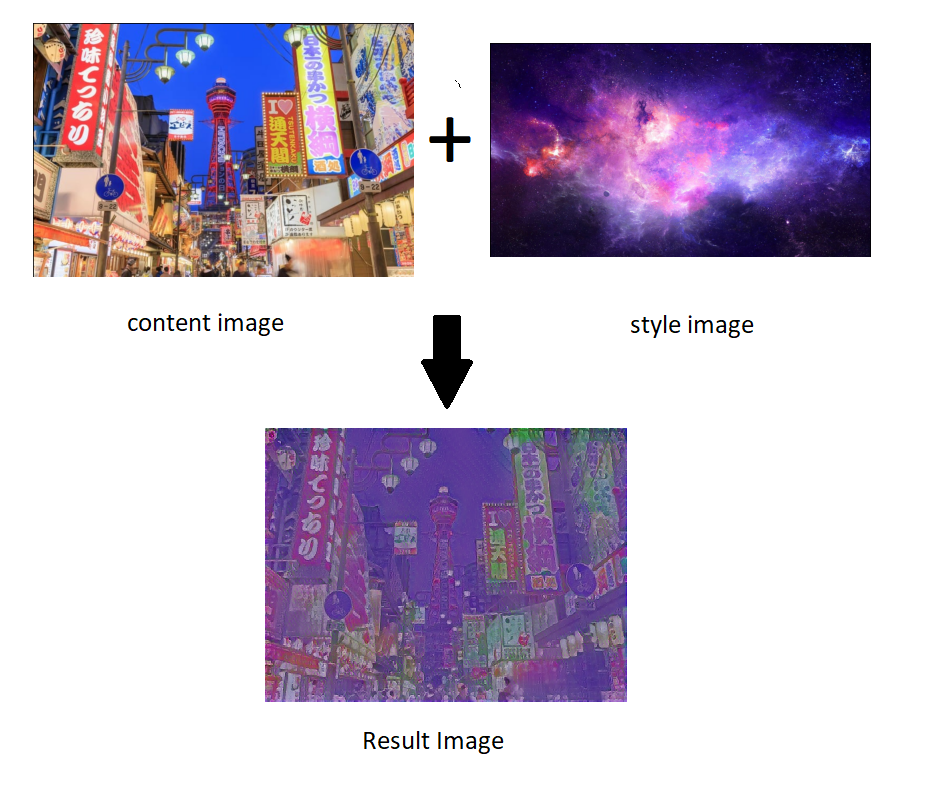

# Backyard-Painting
## Generating panorama paintings

In the COVID-19 situation, our exploration is limited. Maybe wandering around the internet should be a good idea.

Painting natural panoramas is something special, and needs a lot of techniques. However, by this time you could generate your own panorama paintings, and use it for wallpaper or anything.

This project was a simple implementation of Neural Style Transfer, some kind of generative network. Running on Tensorflow platform, this network utilize transfer model from the tensorhub. 

# How to play?

* Open the notebook, it is better to open it in Colab unless you have fancy GPU.
* Just run the cell. You have two options whether to upload the files or copying the URLs. 
* Enjoy!

### You could contribute for my future plan to pursue my PhD too!

# References

[Neural style transfer](https://www.tensorflow.org/tutorials/generative/style_transfer)

[magenta/arbitrary-image-stylization-v1-256](https://tfhub.dev/google/lite-model/magenta/arbitrary-image-stylization-v1-256/fp16/prediction/1)

Gatys, Leon A., Alexander S. Ecker, and Matthias Bethge. "A neural algorithm of artistic style." arXiv preprint arXiv:1508.06576 (2015).
